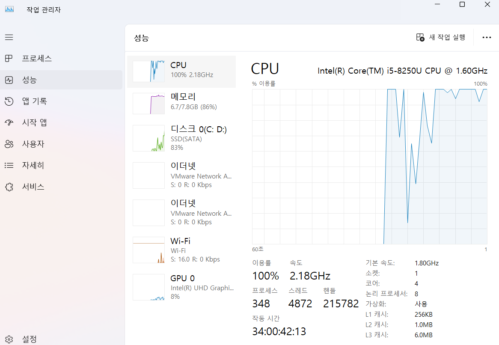
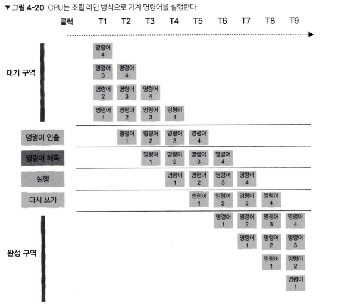

# 4장 트랜지스터에서 CPU로 이보다 더 중요한 것은 없다. (1) 4.1 ~ 4.5 282p~320p

## 4.1 이 작은 장난감을 CPU라고 부른다.

각종 계산이 가능한 산술 논리 장치, 정보를 저장할 수 있는 레지스터, 작업을 함께하도록 제어해 주는 클럭 신호를 갖추어 한데 묶은 것을 중앙 처리 장치 -> CPU 또는 프로세서

## 4.2 CPU는 유휴 상태(idle time)일 때 무엇을 할까?

OS가 대기열을 이용하여 프로세스를 관리할때 ready queue가 비어있다
-> CPU가 유휴 상태에 있다는 것을 의미할 것임

이때 무엇인가를 해야만 하는 상황에서 항상 준비 완료가 되어있는 프로세스를 꺼내기 위한
System Idle Process(유휴 프로세스)를 사용합니다.

이 프로세스는 항상 준비 완료 상태이며 우선순위가 가장 낮게 배치되어 있습니다.

이 유휴 프로세스가 하는 일은?

가장 기본적인 역할은 CPU를 점유하여 CPU가 완전히 "멈추는" 상태를 방지하는 것. CPU가 유휴 상태로 있으면 전력 소비를 줄이기 위해 저전력 모드로 전환될 수 있지만, 유휴 프로세스는 CPU를 계속 사용하면서 최소한의 작업만 수행하여 CPU가 빠르게 다시 활성화될 수 있도록 준비

어떠한 하나의 프로그램이 무한 순환 되는 중에도 다른 프로그램이 정상적으로 응답하는 것이 가능한 이유? -> 타이머 인터럽트!

OS는 일정 시간마다 타이머 인터럽트를 생성하여 CPU가 인터럽트 신호를 감지하고, OS 내부의 인터럽트 처리 프로그램을 실행함 -> 이 인터럽트 처리 함수에서 프로세스가 실행될 준비가 되었는지 판단하여 중단 되었던 프로세스를 계속 실행함

## 4.3 CPU는 숫자를 어떻게 인식할까?

CPU는 수 많은 트랜지스터로 구성되어 있으며 트랜지스터는 입력 전압에 따라 on/off 상태 변경을 실시함 -> 0,1 2진수로 표현되는 이유

음수 표현 방법

1. 부호-크기 표현 : 최상위 비트를 1로 바꾸기만 한 표현
2. 1의 보수 표현 : 2진수의 반대수로 반전시킨 표현
3. 2의 보수 표현 : 1의 보수 + 1 -> 2의 보수 (이 방법은 현대 컴퓨터 시스템에서 사용 되는 방식)

이런 표현 방법이 있다해도 CPU는 결국 숫자 자체의 표현 방식에 대해 알지 못함
결국 명령에 따라 실행되는 것 일뿐!

## 4.4 CPU가 if 문을 만났을 때

CPU가 하나의 기계 명령어를 처리하는 과정 단계
1. 명령어 인출
2. 명령어 해독
3. 실행
4. 다시 쓰기

그림처럼 각 단계는 별도의 하드웨어로 처리됩니다.

분기 점프 명령어가 실행을 완료하기 전에 다음 명령어는 이미 파이프라인이 들어가 있어야함
-> 파이프라인에 빈 공간이 생겨 프로세서의 리소스를 완전하게 사용할 수 없기 때문

그렇다면 명령어 실행이 완료되지 않은 시점에 CPU는 어떤 분기의 명령어를 파이프라인에 넣어야 할지 아는 방법? -> 미리 예측하기!

분기 예측 : 프로그램 실행 이력을 기반 등의 여러 데이터를 기반으로 CPU가 뒤이어 어디로 분기할 가능성이 있는지 추측하는 것

물론 예측에 실패한다면 그만큼의 성능이 좋지 않은 점이 발생함
-> 분석 도구(perf)등으로 분기 예측이 성능 병목 현상의 원인은 아닌지 확인해야함

## 4.5 CPU 코어 수와 스레드 수 사이의 관계는 무엇일까?

CPU = 요리사 , CPU 코어 수 = 요리사 수
일정 시간 동안 볶을 수 있는 요리 수 = 스레드 수

둘 사이의는 필연 관계가 없기 때문에 단일 코어 시스템에서도 많은 스레드 생성이 가능함
-> 메모리가 충분하고 OS의 제한이 없어야 함

CPU가 해야할 일은 PC 레지스터 주소에 따라 메모리에서 기계 명령어를 꺼내 실행하는 것 뿐

과연 단일 코어라고해서 다중 스레드가 의미가 없는가?
결국 동시에 여러 작업을 실행할 수 있다는 점에서 의미가 있을 것임

다중 코어를 최대한 활용 해야한다는 것은 시스템에 코어가 몇 개 있는지 알고 있어야함
-> 일반적으로 생성되는 스레드 수는 코어 수와 일정한 선형 관계를 유지해야 함

스레드는 많다고 좋다는 것이 아님!
스레드 수가 한계에 달하면 OS 성능이 떨어지기 시작함 왜냐하면 한 스레드에서 다른 스레드로 전환할 때 부담이 증가하기 때문!

